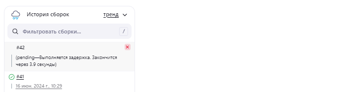
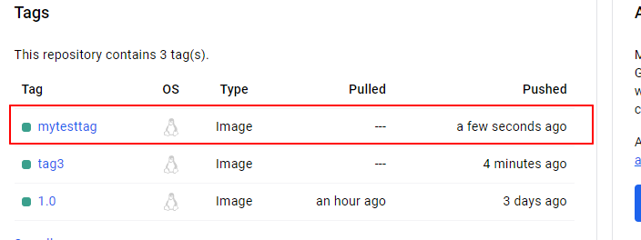

# Выполнение
## 1 terraform
[директория](./project/terraform)

## 2 k8s
### 2.1 Установка используя ansible
Рабочая директрия  [директориы](./project/ansible/kubespay/)  
#### 2.1.1 Установка окружения ansible на рабочий хост

```
apt install python39
apt install git
git clone https://github.com/kubernetes-sigs/kubespray
pip3 install -r requirements.txt
```

Далее копируем инвентори . Для нового имени используем имя кластера

 ``cp -rp inventory/sample/ inventory/k8s-dev-cluster``

 `` tree inventory/k8s-dev-cluster/ -L 1``

 И правим наш инвентори 

```
 [all]
node1 ansible_host=192.168.27.242  # ip=10.3.0.1 etcd_member_name=etcd1
node2 ansible_host=192.168.27.151  # ip=10.3.0.2 etcd_member_name=etcd2
node3 ansible_host=192.168.27.154  # ip=10.3.0.3 etcd_member_name=etcd3

[kube_control_plane]
node1

[etcd]
node1

[kube_node]
node2
node3

[calico_rr]

[k8s_cluster:children]
kube_control_plane
kube_node
calico_rr
```

Далее переходим к файлу  inventory/k8s-dev-cluster/group_vars/k8s_cluster/k8s-cluster.yml

```

cluster_name - тут в значении указывается имя кластера,
kube_version - версия кластера, по умолчанию стоит самая последняя версия
kube_network_plugin - используемый сетевой плагин (cni). В этом сетапе я буду использовать flannel. Этот плагин намного проще, и идеально вписывается в нашу конценцию где все ноды кластера работают из одной сети.
kube_proxy_mode - режим проксирования, по умолчанию стоит ipvs. Я всеже предпочитаю iptables.
kube_service_addresses - здесь прописываем адресный пул, ip-адреса из которой будут выдаваться нашим сервисом с режимом работы ClusterIP.
kube_pods_subnet - и здесь указывается пул, из которого будут выдаваться адреса для подов.
dns_mode - здесь указываем dns сервер, который будет обслуживать наш кластер
kubeconfig_localhost - а включение этой опции, сгенерит kube-конфиг для подключения к кластеру.

```

Переходим к файлу m inventory/k8s-dev-cluster/group_vars/k8s_cluster/k8s-net-flannel.yml

```

flannel_backend_type - здесь мы переопределяем режим работы плагина, на режим host gateway.
flannel_interface_regexp - эта регулярка описывающая, в какой сети у меня будут подняты сервера

```


          {
            "registry-mirrors": [
              "https://mirror.gcr.io",
              "https://daocloud.io",
              "https://c.163.com/",
              "https://huecker.io/",
              "https://registry.docker-cn.com"
            ]
          } 
          > /etc/docker/daemon.json


## Docker
https://hub.docker.com/repository/docker/alwx1753/devops-project/general
### build docker file
Dockerfile:
```
#Берем последнюю версию nginx
FROM nginx:latest

#Копируем  файл конфиг который находится рядом с dockerfile и помечаем в папку с nginx
COPY index.html /usr/share/nginx/html/
COPY nginx.conf /etc/nginx/nginx.conf
#Открываем порт 80 для работы nginx
EXPOSE 80

#Запускаем команду nginx в фоновом режиме
CMD ["nginx", "-g", "daemon off;"] 
# CMD ["nginx", "-g", "daemon off;", "-c", "/etc/nginx/nginx.conf"]
```
Выполняем команды:
```
docker build -t alwx1753/devops-project .
docker tag alwx1753/devops-project:latest alwx1753/devops-project:1.0
docker login
docker push alwx1753/devops-project:1.0
```

Чтобы удалить все запущенные контейнеры а затем образы:
```
docker rm $(docker ps -a -q)
docker rmi $(docker images -q)
```

# Решение1: Gitlub , Gitlab CI, ansible kuberspay
## Kuberspay
У меня уже есть сови 3 виртуальные машины. Поэтому я добавляю данные в devops-project/project/ansible/kubespay/kubespray/inventory/k8s-dev-cluster/inventory.ini
```
[all]
node1 ansible_host=192.168.27.242  ansible_user=root ansible_ssh_port=22 ansible_ssh_private_key_file=/root/.ssh/id_rsanew
node2 ansible_host=192.168.27.149  ansible_user=root ansible_ssh_port=22 ansible_ssh_private_key_file=/root/.ssh/id_rsanew
node3 ansible_host=192.168.27.154  ansible_user=root ansible_ssh_port=22 ansible_ssh_private_key_file=/root/.ssh/id_rsanew
[kube_control_plane]
node1
[etcd]
node1
[kube_node]
node2
node3
[calico_rr]
[k8s_cluster:children]
kube_control_plane
kube_node
calico_rr
```
и запускаю плейбук находясь в директории ``devops-project/project/ansible/kubespay/kubespray/``
```
ansible-playbook -i inventory/k8s-dev-cluster/inventory.ini -u root cluster.yml -b -v
```
## Gitlab
Создал новый репозиторий https://gitlab.com/devops9835924/devops-project

```
cd existing_repo
git remote add origin https://gitlab.com/devops9835924/devops-project.git
git branch -M main
git push -uf origin main

```

## Monitoring and web app
Создадим новую область для веб приложения и мониторинга
```
kubectl create namespace monitoring
kubectl get namespace
```

Для создания мониторинга возьмем helm чарт
```
helm repo add prometheus-community https://prometheus-community.github.io/helm-charts
helm install stable prometheus-community/kube-prometheus-stack --namespace=monitoring
kubectl apply -f ingress.yml -n monitoring
 kubectl --namespace monitoring get pods -l "release=stable"
```

```
helm repo add ingress-nginx https://kubernetes.github.io/ingress-nginx && \
helm repo update && \
helm install ingress-nginx ingress-nginx/ingress-nginx

или

kubectl apply -f https://raw.githubusercontent.com/kubernetes/ingress-nginx/controller-v1.0.0/deploy/static/provider/baremetal/deploy.yaml
```

Так как у меня кластер k8s является локаьлныи и не имеет loadbalancer мне необходимо исползовать ingress-nginx и nodeport . Для доступа с другой машины необходимо прописать в файле hosts:

```

192.168.27.242 app.test.com
192.168.27.242 grafana.domen.ru
```

а так же логин и пароль для графана

```
UserName: admin Password: prom-operator
```

## CI/CD

GITLAB CI

```
stages:
  - build
  - deploy

build:
  stage: build
  variables: 
    DOCKER_HOST: tcp://docker:2376
    DOCKER_DRIVER: overlay2
  script:
    - docker build -t $CI_REGISTRY_IMAGE ./docker
    - docker login -u $DOCKER_USERNAME -p $DOCKER_PASSWORD
    - docker push $CI_REGISTRY_IMAGE

deploy:
  stage: deploy
  script:
    - echo $CI_REGISTRY_IMAGE
    - docker build -t $CI_REGISTRY_IMAGE:$CI_COMMIT_TAG .
    - docker push $CI_REGISTRY_IMAGE:$CI_COMMIT_TAG
    - kubectl apply -f ./k8s/myapp.yml
  only:
    - branches
    - tags

```
# Решение2 Jenkins, Github, k8s_yandex_cloud
##  k8s_yandex_cloud
Создаю кластер kubernetes и  узлы используя 
```
terraform init
terraform apply --auto-approve
```
После создания кластера на сервере с предустановленным yandex CLI , чтобы получить конфиг файл кластера k8s по пути ``~/.kube/config`` необходимо выполнить команду:
```
yc managed-kubernetes cluster get-credentials --id catca7qm6373qprq6ik4 --external
```
### Настраиваем кластер k8s для работы jenkins
- создаем новую область для работы jenkins
  ```
  -kubectl create namespace jenkins
  ```
- создаем пользователя и токен ключ для работы jenkins 
  ```
  kubectl create sa jenkins -n jenkins
  kubectl create token jenkins -n jenkins --duration=8760h
- добавляем роль 
  ```
  kubectl create rolebinding jenkins-admin-binding --clusterrole=admin --serviceaccount=jenkins:jenkins --namespace=jenkins
  ```
Теперь можно вывести конфиг командой ``kubectl config view``
## Github
- Создал  репозиторий 
- Настроил webhooks в 
  
## Jenkins
- Развернул виртуальную машину с белым ip чтобы работали webhooks в github.
- установил несколько плагинов: ,, 
- настроил kubernetes cloud 
  
- написал 

Далее для теста выполняю следующее
- редактирую любой файл в репозитории 
- выполняю команду  ``git add --all && git commit -m "test kube" && git push``
- jenkins автоматически запускает pipeline
  
- выполняю команду  ``git tag mytesttag $$ git push --tags``  и снова ``git push``
- проверяем сборку в 
  


