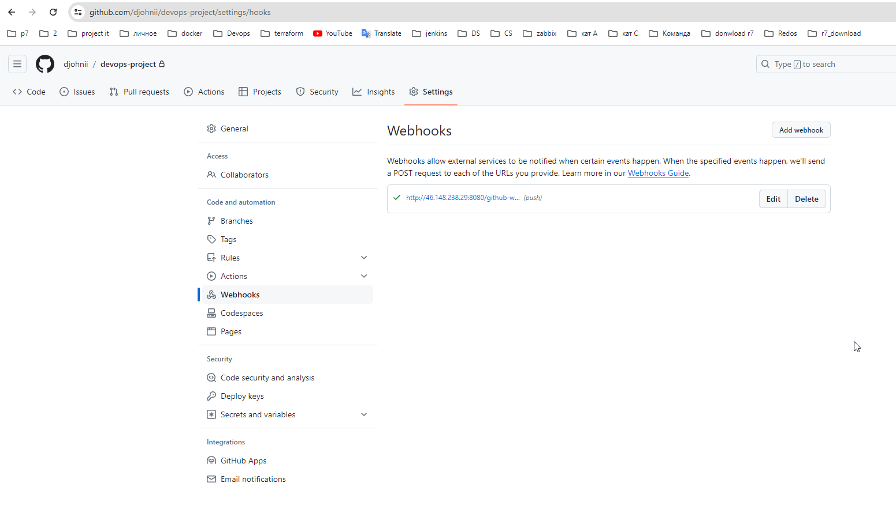
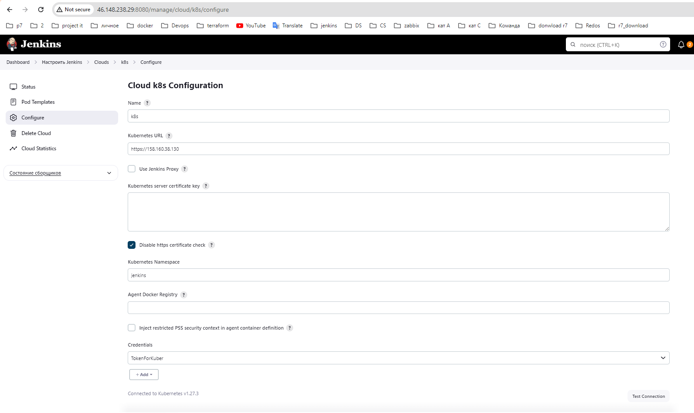
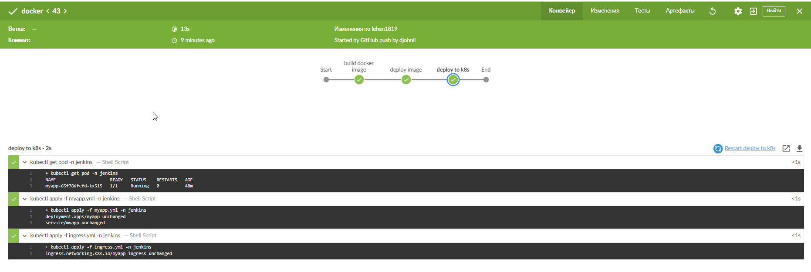

# Дипломная работа

[Весь код в директории](./project/)

[terraform](./project/terraform)

[terraform-k8s](./project/terraform/k8s)

[k8s](./project/k8s)

[docker](./project/docker)


# Решение1: Docker, Jenkins, Github, k8s_yandex_cloud
В данном решение используются:
- `CICD`: Jenkins in k8s from yandex cloud
- `Kubernetes:` k8s yandex cloud
- `IAC:` Terraform
- `Git` Github

##  k8s_yandex_cloud
Создаю кластер kubernetes и  узлы используя [terraform](./project/terraform/k8s/)
```
terraform init
terraform apply --auto-approve
```
После создания кластера на сервере с предустановленным yandex CLI , чтобы получить конфиг файл кластера k8s по пути ``~/.kube/config`` необходимо выполнить команду:
```
yc managed-kubernetes cluster get-credentials --id catca7qm6373qprq6ik4 --external
```

Чтобы не вводить эту команду каждый раз вручную я коде terraform добавил блок с флагом --force для перезаписи кониг файла.(можно вывести конфиг командой ``kubectl config view``)

```
resource "null_resource" "kubectl" {
    provisioner "local-exec" {
        command = "yc managed-kubernetes cluster get-credentials --id ${yandex_kubernetes_cluster.regional_cluster.id} --external --force"
    }
}
```

### Настраиваем кластер k8s для работы jenkins

Ссылка руководства установки  [Jenkins в кластер kubernetes](https://www.jenkins.io/doc/book/installing/kubernetes/)
- создаем новую область для работы jenkins
  ```
  kubectl create namespace devops-tools

  ```
 - создаем сервисный аккаунт [service.yaml](./project/k8s/jenkins/serviceaccount.yaml)
 - создаем диск [volume.yaml](./project/k8s/jenkins/volume.yaml)

так как диск я создаю на хосте, необходимо указать ноду . Для этого в файле [volume.yaml](./project/k8s/jenkins/volume.yaml) меняем значения ``values: - Имя_НОДЫ`` на имя любой ноды. Для просмотра нод можно использовать команду ``kubectl get node``

```
  nodeAffinity:
    required:
      nodeSelectorTerms:
      - matchExpressions:
        - key: kubernetes.io/hostname
          operator: In
          values:
          - ИМЯ_НОДЫ
```
 
- создаем [deployment.yaml](./project/k8s/jenkins/deployment.yaml)
- создаем [service.yaml](./project/k8s/jenkins/service.yaml)
- создаем [ingress.yaml](./project/k8s/jenkins/ingress.yaml)

- теперь можно выполнить деплой указав папку ка файлам

```
kubectl apply -f ./project/k8s/jenkins/
```

- Далее устанавливаю ingress-nginx для доступа в jenkins 

```
helm repo add ingress-nginx https://kubernetes.github.io/ingress-nginx && helm repo update && helm install ingress-nginx ingress-nginx/ingress-nginx 
```

Для вывода токена jenkins использовать следующую команду

```
kubectl logs jenkins-56b6774bb6-5nfv8 -n devops-tools
```

### Настройка мониторинга в кластере kubernetes

Создадим новую область для веб приложения и мониторинга

```
kubectl create namespace monitoring
kubectl get namespace
```

Для создания мониторинга возьмем helm чарт

```
helm repo add prometheus-community https://prometheus-community.github.io/helm-charts
helm install stable prometheus-community/kube-prometheus-stack --namespace=monitoring
kubectl apply -f ingress.yml -n monitoring
kubectl --namespace monitoring get pods -l "release=stable"
```


Для доступа с другой машины необходимо прописать в файле hosts:

```

192.168.27.242 app.test.com
192.168.27.242 grafana.domen.ru
```

а так же логин и пароль для графана

```
UserName: admin Password: prom-operator
```


## Github
- Создал [GitHub](https://github.com/djohnii/devops-project) репозиторий 
- Настроил webhooks в [github](https://github.com/djohnii/devops-project/settings/hooks)
  
## Jenkins
- Развернул виртуальную машину с белым ip чтобы работали webhooks в github.
- установил несколько плагинов: [kubernetes](https://plugins.jenkins.io/kubernetes-cli/),[docker](https://plugins.jenkins.io/docker-worcflow),[github](https://plugins.jenkins.io/github-api/) [Blue Ocean](https://plugins.jenkins.io/blueocean/)
- настроил kubernetes cloud 
  
- написал [jenkinsfile](./project/Jenkinsfile)

Далее для теста выполняю следующее
- редактирую любой файл в репозитории [GitHub](https://github.com/djohnii/devops-project)
- выполняю команду  ``git add --all && git commit -m "test kube" && git push``
- jenkins автоматически запускает pipeline
  
- выполняю команду  ``git tag mytesttag $$ git push origin main --tags`` 
- проверяем сборку в [dockerhub](https://hub.docker.com/repository/docker/alwx1753/devops-project/general)
  




# Решение2: Docker, Gitlub , Gitlab CI, ansible kuberspay (не актуально)
##  Docker
репозиторий: https://hub.docker.com/repository/docker/alwx1753/devops-project/general

Dockerfile:
```
#Берем последнюю версию nginx
FROM nginx:latest

#Копируем  файл конфиг который находится рядом с dockerfile и помечаем в папку с nginx
COPY index.html /usr/share/nginx/html/
COPY nginx.conf /etc/nginx/nginx.conf
#Открываем порт 80 для работы nginx
EXPOSE 80

#Запускаем команду nginx в фоновом режиме
CMD ["nginx", "-g", "daemon off;"] 
# CMD ["nginx", "-g", "daemon off;", "-c", "/etc/nginx/nginx.conf"]
```
Выполняем команды:
```
docker build -t alwx1753/devops-project .
docker tag alwx1753/devops-project:latest alwx1753/devops-project:1.0
docker login
docker push alwx1753/devops-project:1.0
```

Чтобы удалить все запущенные контейнеры а затем образы:
```
docker rm $(docker ps -a -q)
docker rmi $(docker images -q)
```

Решение проблемы с dockerhub
/etc/docker/daemon.json:
```
          {
            "registry-mirrors": [
              "https://mirror.gcr.io",
              "https://daocloud.io",
              "https://c.163.com/",
              "https://huecker.io/",
              "https://registry.docker-cn.com"
            ]
          } 
```
## Kuberspay
У меня уже есть свои 3 виртуальные машины. Поэтому я добавляю данные в devops-project/project/ansible/kubespay/kubespray/inventory/k8s-dev-cluster/inventory.ini
```
[all]
node1 ansible_host=192.168.27.242  ansible_user=root ansible_ssh_port=22 ansible_ssh_private_key_file=/root/.ssh/id_rsanew
node2 ansible_host=192.168.27.149  ansible_user=root ansible_ssh_port=22 ansible_ssh_private_key_file=/root/.ssh/id_rsanew
node3 ansible_host=192.168.27.154  ansible_user=root ansible_ssh_port=22 ansible_ssh_private_key_file=/root/.ssh/id_rsanew
[kube_control_plane]
node1
[etcd]
node1
[kube_node]
node2
node3
[calico_rr]
[k8s_cluster:children]
kube_control_plane
kube_node
calico_rr
```
и запускаю плейбук находясь в директории ``devops-project/project/ansible/kubespay/kubespray/``
```
ansible-playbook -i inventory/k8s-dev-cluster/inventory.ini -u root cluster.yml -b -v
```
## Gitlab
Создал новый репозиторий https://gitlab.com/devops9835924/devops-project

```
cd existing_repo
git remote add origin https://gitlab.com/devops9835924/devops-project.git
git branch -M main
git push -uf origin main

```

## Monitoring and web app
Создадим новую область для веб приложения и мониторинга
```
kubectl create namespace monitoring
kubectl get namespace
```

Для создания мониторинга возьмем helm чарт
```
helm repo add prometheus-community https://prometheus-community.github.io/helm-charts
helm install stable prometheus-community/kube-prometheus-stack --namespace=monitoring
kubectl apply -f ingress.yml -n monitoring
 kubectl --namespace monitoring get pods -l "release=stable"
```

```
helm repo add ingress-nginx https://kubernetes.github.io/ingress-nginx && \
helm repo update && \
helm install ingress-nginx ingress-nginx/ingress-nginx

или

kubectl apply -f https://raw.githubusercontent.com/kubernetes/ingress-nginx/controller-v1.0.0/deploy/static/provider/baremetal/deploy.yaml
```

Так как у меня кластер k8s является локаьлныи и не имеет loadbalancer мне необходимо исползовать ingress-nginx и nodeport . Для доступа с другой машины необходимо прописать в файле hosts:

```

192.168.27.242 app.test.com
192.168.27.242 grafana.domen.ru
```

а так же логин и пароль для графана

```
UserName: admin Password: prom-operator
```


## CI/CD

GITLAB CI

```
stages:
  - build
  - deploy

build:
  stage: build
  variables: 
    DOCKER_HOST: tcp://docker:2376
    DOCKER_DRIVER: overlay2
  script:
    - docker build -t $CI_REGISTRY_IMAGE ./docker
    - docker login -u $DOCKER_USERNAME -p $DOCKER_PASSWORD
    - docker push $CI_REGISTRY_IMAGE

deploy:
  stage: deploy
  script:
    - echo $CI_REGISTRY_IMAGE
    - docker build -t $CI_REGISTRY_IMAGE:$CI_COMMIT_TAG .
    - docker push $CI_REGISTRY_IMAGE:$CI_COMMIT_TAG
    - kubectl apply -f ./k8s/myapp.yml
  only:
    - branches
    - tags

```

